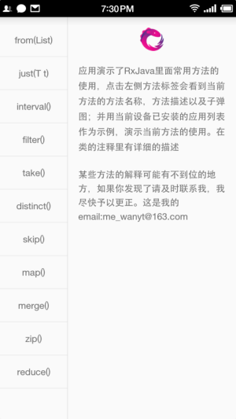
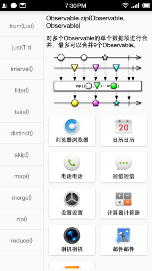

# RxJava Practice

这是一个RxJava的实践项目，展示了RxJava的各个方法的使用方法。在应用的左侧点击方法列表的方法，在右侧可以看到方法的全称，方法描述，子弹图，和当前方法的代码演示结果。

如果你发现项目中有错误的地方或者可以改进的地方，请与我联系：[me_wanyt@163.com](http://mail.163.com/)

## 预览




## 待解决的问题

现在工程中加载的子弹图是在mipmap目录中的，在正式的开发环境中是不允许这样做的，因为这样做会增加APK的体积，常见的优化方案是从网络中加载图片。加载图片用的是Glide，使用Glide在网络上加载图片的时候不能显示图片，使用抓包工具查看的时候图片已经返回回来了但是没有加载出来，这个问题一直让我很费解，直到现在也没有解决，如果你找到了解决的办法请务必联系我：[me_wanyt@163.com](http://mail.163.com/) 

# 第三方库

```
    compile 'com.android.support:recyclerview-v7:24.0.0'
    compile 'com.android.support:cardview-v7:24.0.0'
    compile 'com.android.support:design:24.0.0'
    compile 'com.android.support:appcompat-v7:24.0.0'
    //Butter Knife
    apt 'com.jakewharton:butterknife-compiler:8.1.0'
    compile 'com.jakewharton:butterknife:8.1.0'
    //RxJava
    compile 'io.reactivex:rxjava:1.1.6'
    compile 'io.reactivex:rxandroid:1.2.1'
    //Logger 非常推荐使用的log库
    compile 'com.orhanobut:logger:1.15'
    //glide
    compile 'com.github.bumptech.glide:glide:3.7.0'

```